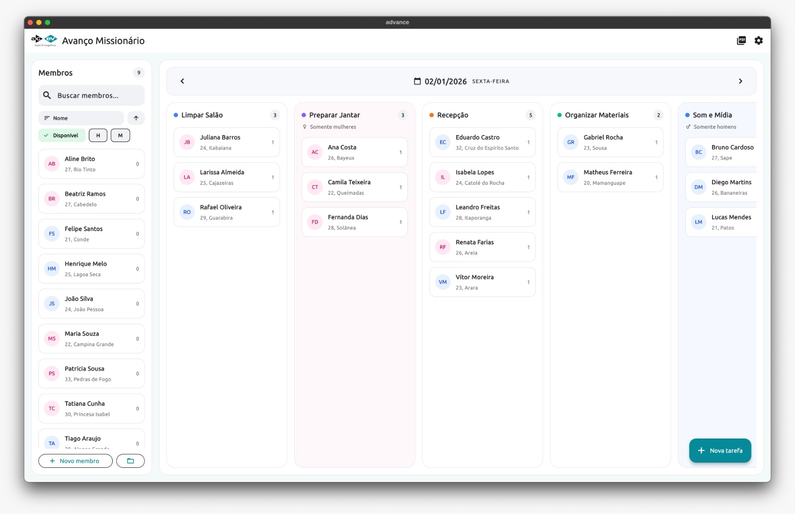
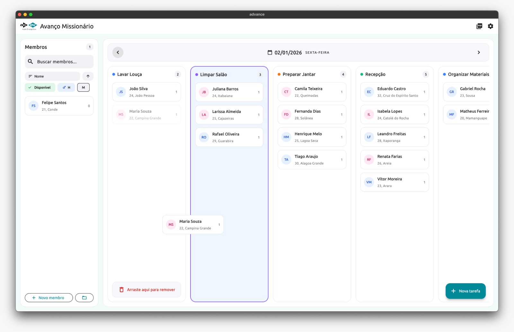
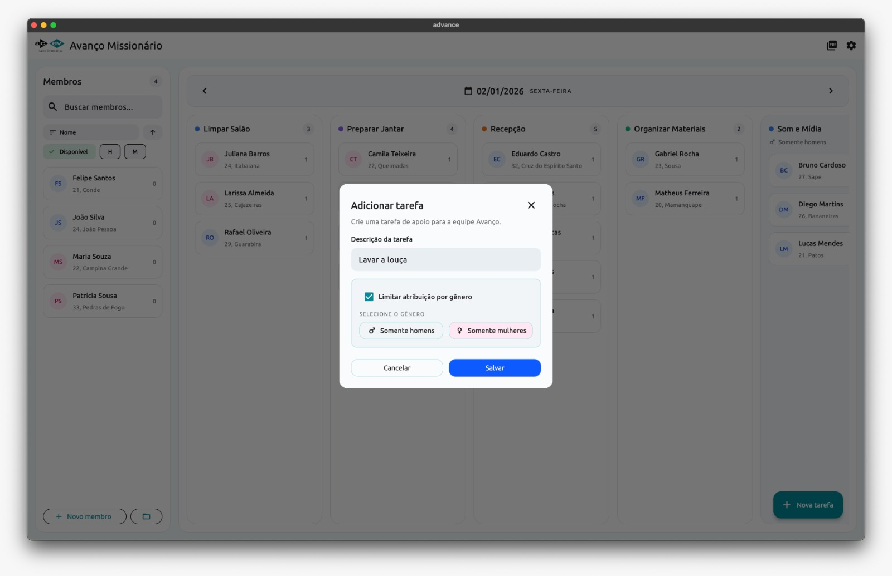
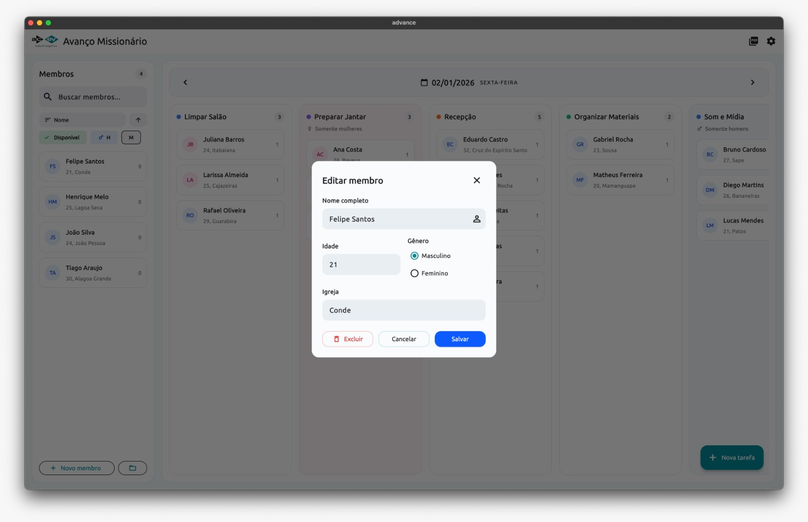
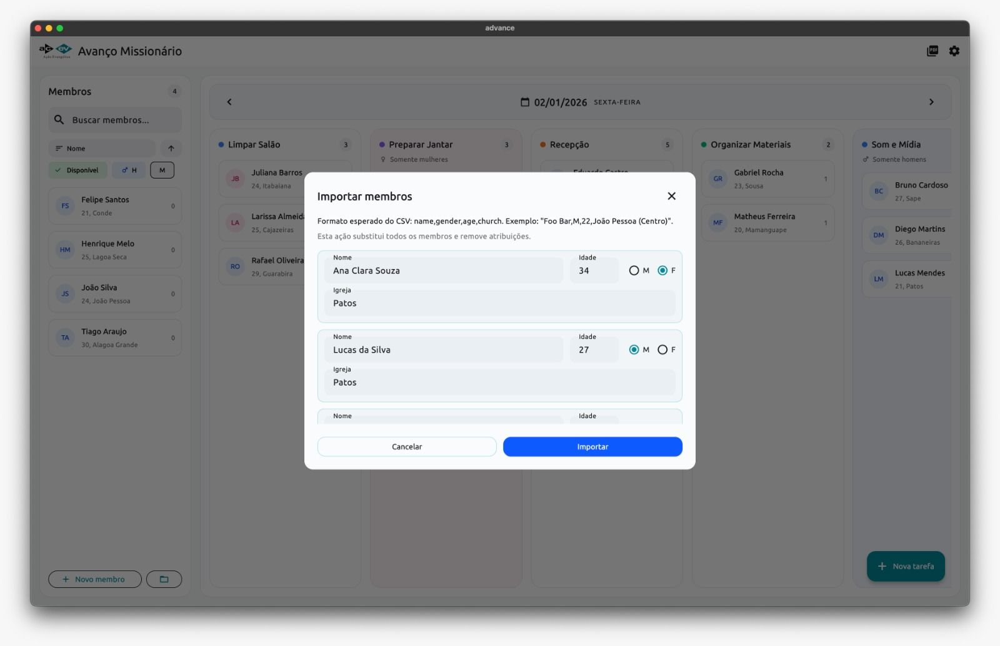
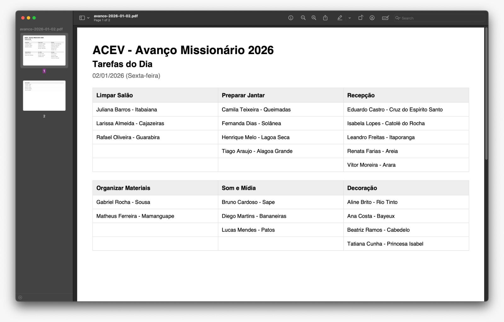

# Avanço Missionário

> Nota: Este app foi desenvolvido em 8 horas usando Codex, com pouca ou nenhuma supervisão sobre a qualidade do código.

## Contexto

Avanço Missionário é um projeto missionário da ACEV, uma igreja brasileira do estado da Paraíba. O app é usado pela equipe de staff para organizar tarefas diárias (lavar louça, limpar banheiros, recepção, etc.), ajudando a distribuição justa do trabalho e a rotina do evento.

## Visão geral

Aplicativo desktop em Flutter com banco local SQLite. Permite:

- Cadastro e edição de membros e tarefas
- Atribuição diária via drag-and-drop
- Exportação do dia em PDF (formato tabela)
- Exportação do banco completo (.db)

## Capturas de tela

## Principais funcionalidades

- **Membros**: cadastro, edição, remoção, filtros e ordenação
- **Tarefas**: cadastro, edição, remoção e restrição por gênero
- **Atribuições**: arrastar membros para tarefas por dia (transação atômica)
- **Relatórios**: PDF em formato de tabela por dia
- **Dados**: exportação do banco (.db)

## Modelo de dados

- **Member**: id, name, age, gender, church
- **Task**: id, name, gender_constraint (nullable)
- **MemberTask**: id, member_id, task_id, date

## Fluxo de uso

1. Cadastre membros e tarefas.
2. Selecione o dia.
3. Arraste membros para as tarefas.
4. Gere o PDF do dia quando necessário.

## PDF do dia

- Orientação: paisagem
- Layout em tabela com tarefas como colunas
- Exibe nome do membro e igreja
- Ignora idade e gênero
- Tarefas vazias não aparecem

## Exportação do banco

- Exporta o arquivo .db completo

## Instalação

O instalador foi gerado com **Inno Setup**.

## Execução

- Flutter Desktop
- Banco local SQLite
